# Job Application Tracker — End-to-End DevOps Project


> **TL;DR:** A Flask-based Job Application Tracker developed and deployed through a complete DevOps workflow using GitHub Actions, Pytest, SonarCloud, Docker, Trivy, Amazon ECR, Kubernetes (K3s), Argo CD GitOps, Traefik Ingress, Prometheus, and Grafana. The project demonstrates automated testing, code analysis, container security, cloud deployment, GitOps-based Kubernetes synchronization, and application monitoring.

## Project Status

This project is **complete and archived**. The full pipeline — from commit to monitored Kubernetes deployment — was built, tested, and verified end-to-end, with evidence captured at every stage (see [Selected Project Evidence](#selected-project-evidence)).

The AWS infrastructure (EC2 host, K3s cluster, ECR repository) was **intentionally decommissioned** after verification to avoid ongoing cloud costs, following the checklist in [Cleanup](#cleanup). The application source code, Kubernetes manifests, CI/CD pipeline, and Helm/Argo CD configuration remain in this repository and can be redeployed to any EC2 instance or Kubernetes cluster by following the steps below.

## Table of Contents

- [Overview](#overview)
- [Architecture](#architecture)
- [Key Features](#key-features)
- [Technology Stack](#technology-stack)
- [Project Structure](#project-structure)
- [Prerequisites](#prerequisites)
- [Run the Application Locally](#run-the-application-locally)
- [Testing](#testing)
- [Docker](#docker)
- [GitHub Actions CI Pipeline](#github-actions-ci-pipeline)
- [SonarCloud](#sonarcloud)
- [Container Security with Trivy](#container-security-with-trivy)
- [AWS IAM and GitHub OIDC](#aws-iam-and-github-oidc)
- [Amazon ECR](#amazon-ecr)
- [Kubernetes / K3s](#kubernetes--k3s)
- [Argo CD GitOps](#argo-cd-gitops)
- [Application Access](#application-access)
- [Monitoring](#monitoring)
- [Data Persistence](#data-persistence)
- [Verification](#verification)
- [Troubleshooting](TROUBLESHOOTING.md) (separate file)
- [Selected Project Evidence](#selected-project-evidence)
- [Security Considerations](#security-considerations)
- [AWS Cost Management](#aws-cost-management)
- [Cleanup](#cleanup)
- [Future Improvements](#future-improvements)
- [Project Outcome](#project-outcome)
- [Conclusion](#conclusion)
- [License](#license)
- [Author](#author)

## Overview

This project started as a simple Flask-based Job Application Tracker and was extended into an end-to-end DevOps implementation.

The application provides a simple interface for managing job applications, including adding, searching, updating, editing, and deleting application records.

The application itself is intentionally simple. The primary objective of this project is to demonstrate the complete DevOps lifecycle around the application.

The project implements:

- **Flask** — web application framework
- **Pytest** — automated application testing
- **GitHub** — source code management
- **GitHub Actions** — CI/CD automation
- **SonarCloud** — static code analysis
- **Docker** — application containerization
- **Trivy** — container security scanning
- **Amazon ECR** — private container registry
- **AWS EC2** — Kubernetes host
- **K3s** — lightweight Kubernetes distribution
- **Argo CD** — GitOps-based Kubernetes deployment
- **Traefik** — Kubernetes Ingress controller
- **Prometheus** — metrics collection
- **Grafana** — monitoring and visualization

The final workflow connects application development, CI, security scanning, container publishing, GitOps deployment, Kubernetes orchestration, and monitoring.

## Architecture

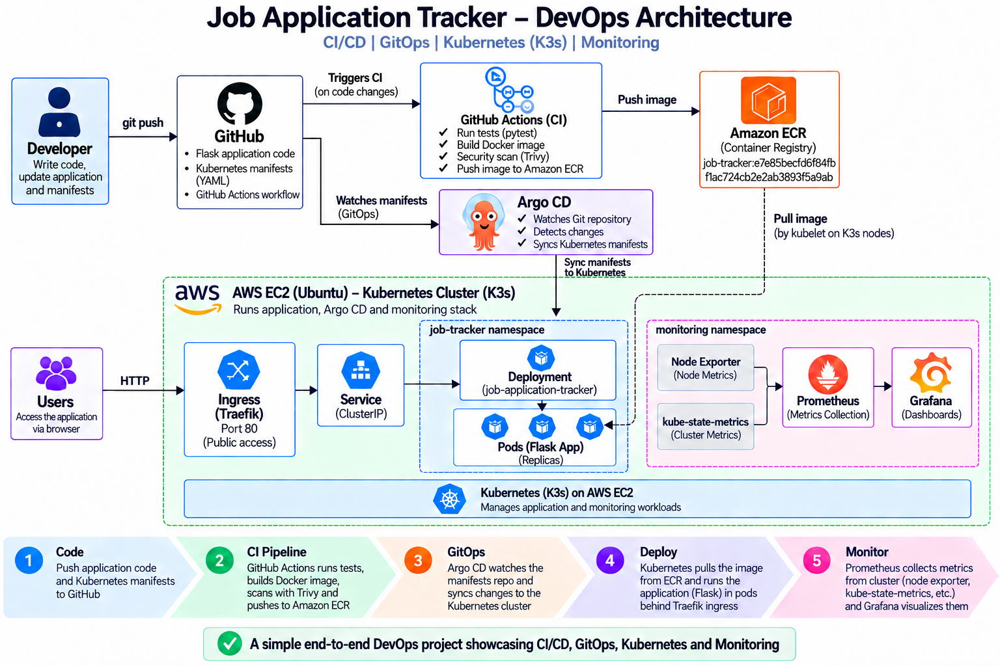

The main DevOps flow is:

```text
Developer
    |
    v
GitHub
    |
    +--------------------------+
    |                          |
    v                          v
GitHub Actions               Argo CD
    |                          |
    |                          v
    |                     Kubernetes
    |                       / K3s
    |                          |
    |                    Traefik Ingress
    |                          |
    |                       Service
    |                          |
    |                      Flask Pods
    |                          |
    +--> Docker Build          |
    |                          |
    +--> Trivy Scan            |
    |                          |
    +--> Amazon ECR <-----------+
```

The container image flow (build/publish) and the GitOps flow (manifest sync) are deliberately separate: **GitHub Actions** builds, scans, and pushes the image to ECR, while **Argo CD** independently watches Git and syncs the Kubernetes manifests. Argo CD never pulls images from ECR directly — Kubernetes' own kubelet does that at pod-scheduling time. This separation, along with the monitoring data path (Node Exporter / kube-state-metrics → Prometheus → Grafana), is covered in more detail in the relevant sections below rather than repeated here.

## Key Features

- Flask-based Job Application Tracker
- Add job applications
- Search job applications
- Update application status
- Edit job applications
- Delete job applications
- Automated Pytest execution
- GitHub Actions CI pipeline
- SonarCloud static code analysis
- Docker image creation
- Trivy filesystem security scanning
- Trivy Docker image security scanning
- Amazon ECR image publishing
- AWS IAM OIDC authentication for GitHub Actions
- Kubernetes deployment using K3s
- Kubernetes Deployment with multiple replicas
- Kubernetes Service
- Traefik Ingress
- Argo CD GitOps deployment
- Automated Argo CD synchronization
- GitOps scaling demonstration
- Prometheus monitoring
- Node Exporter metrics
- kube-state-metrics
- Grafana dashboards
- Pod-level resource monitoring
- AWS cost-conscious temporary infrastructure setup

## Technology Stack

| Technology | Role in the Project |
|---|---|
| Python | Application programming language |
| Flask | Web application framework |
| Pytest | Automated application testing |
| Git | Version control |
| GitHub | Source code repository |
| GitHub Actions | CI/CD automation |
| SonarCloud | Static code analysis |
| Docker | Application containerization |
| Trivy | Container security scanning |
| Amazon ECR | Private Docker image registry |
| AWS EC2 | Kubernetes host |
| K3s | Kubernetes distribution |
| kubectl | Kubernetes resource management |
| Argo CD | GitOps deployment |
| Traefik | Kubernetes Ingress controller |
| Prometheus | Metrics collection |
| Grafana | Metrics visualization |
| YAML | Kubernetes and CI/CD configuration |

## Project Structure

```text
job-application-tracker/
│
├── app.py
├── test_app.py
├── requirements.txt
├── Dockerfile
├── .dockerignore
├── .gitignore
├── sonar-project.properties
├── README.md
│
├── templates/
│   └── index.html
│
├── k8s/
│   ├── namespace.yaml
│   ├── deployment.yaml
│   ├── service.yaml
│   ├── ingress.yaml
│   └── argocd-application.yaml
│
├── .github/
│   └── workflows/
│       └── ci-cd.yml
│
└── Screenshots/
    ├── 01-github-repository.png
    ├── 02-github-actions-success.png
    ├── 03-github-actions-tests.png
    ├── 05-trivy-security-scan.png
    ├── 06-ecr-image.png
    ├── 07-aws-k3s-node.png
    ├── 08-kubernetes-pods.png
    ├── 10-argocd-healthy.png
    ├── 11-argocd-gitops-three-replicas.png
    ├── 12-live-application.png
    ├── 13-prometheus-targets.png
    ├── 14-grafana-dashboard.png
    ├── 15-grafana-pod-metrics.png
    └── 16-final-architecture.png
```

All implementation screenshots are retained in the repository, while this README displays the screenshots that provide the most useful evidence of the DevOps workflow.

## Prerequisites

The following tools are required for local development and testing:

- Python 3.10+
- Git
- Docker
- Docker Compose
- GitHub account
- AWS account (only required if redeploying the cloud infrastructure)
- kubectl
- K3s (or any Kubernetes 1.2x+ distribution)
- Helm
- Argo CD
- Prometheus
- Grafana

Verify the main local tools:

```bash
python --version
git --version
docker --version
kubectl version --client
```

## Run the Application Locally

Create a Python virtual environment:

```bash
python -m venv venv
```

Activate the environment on Git Bash:

```bash
source venv/Scripts/activate
```

Install the dependencies:

```bash
pip install -r requirements.txt
```

Run the Flask application:

```bash
python app.py
```

The application can then be accessed locally through:

```text
http://localhost:5000
```

## Testing

The application uses Pytest for automated testing.

Run the test suite:

```bash
python -m pytest -v
```

The final test suite successfully passed:

```text
3 passed
```

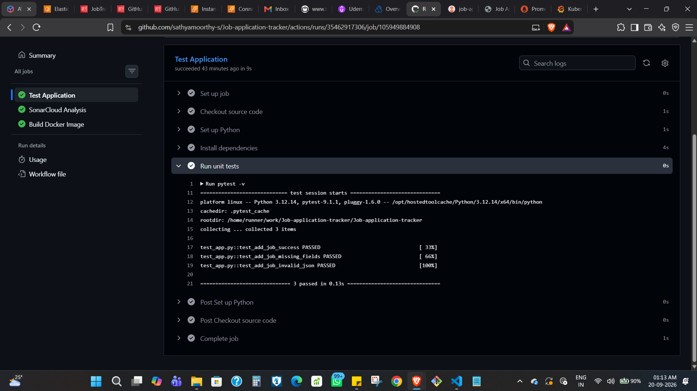

The tests cover:

- Successful job application creation
- Missing required fields
- Invalid JSON input

## Docker

The application is packaged into a Docker image using the project Dockerfile.

Build the image:

```bash
docker build -t job-application-tracker:test .
```

Run the container:

```bash
docker run --rm -p 5000:5000 job-application-tracker:test
```

The container uses Gunicorn to run the Flask application.

The Docker image was tested locally before being integrated into the CI pipeline.

## GitHub Actions CI Pipeline

The GitHub Actions workflow is defined in:

```text
.github/workflows/ci-cd.yml
```

The pipeline performs the following stages:

```text
Git Push
   |
   v
Pytest
   |
   v
SonarCloud
   |
   v
Docker Build
   |
   v
Trivy Filesystem Scan
   |
   v
Trivy Docker Image Scan
   |
   v
AWS OIDC Authentication
   |
   v
Amazon ECR Login
   |
   v
Push Image to ECR
```

The pipeline was verified through successful GitHub Actions runs.

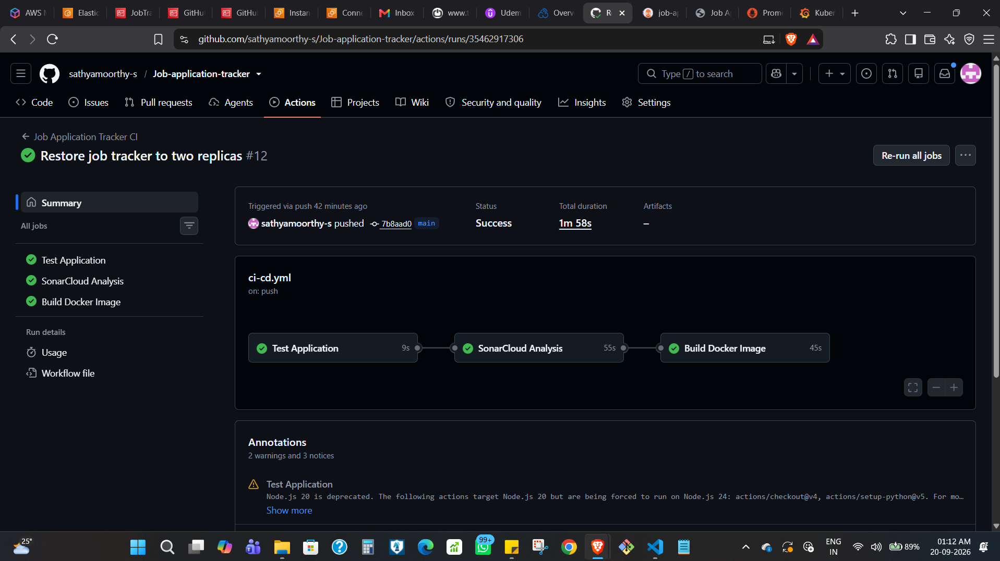

## SonarCloud

SonarCloud was integrated into GitHub Actions for static code analysis.

The project configuration is stored in:

```text
sonar-project.properties
```

SonarCloud provides analysis for:

- Security
- Reliability
- Maintainability
- Code quality
- Code duplication

The SonarCloud analysis runs automatically as part of the CI pipeline. The analysis token is stored as a GitHub repository secret and is never committed to source control.

## Container Security with Trivy

Trivy is used to scan the project and Docker image for vulnerabilities.

The workflow performs:

```text
Filesystem Scan
      |
      v
Docker Build
      |
      v
Docker Image Scan
      |
      v
Amazon ECR
```

The initial Docker image contained Debian package vulnerabilities. The Docker base image and packages were updated, after which the image was rebuilt and scanned again.

The final CI security scanning stage completed successfully.

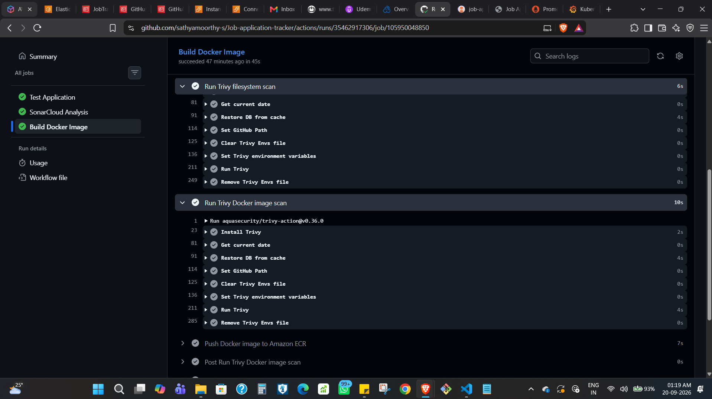

## AWS IAM and GitHub OIDC

GitHub Actions authenticates with AWS using OpenID Connect rather than storing long-lived AWS access keys.

The authentication flow is:

```text
GitHub Actions
      |
      v
GitHub OIDC
      |
      v
AWS IAM Role
      |
      v
Amazon ECR
```

This provides temporary AWS credentials to the workflow and avoids storing permanent AWS access keys in GitHub.

The IAM permissions were restricted to the required ECR operations.

## Amazon ECR

Amazon Elastic Container Registry is used as the private Docker image registry.

GitHub Actions pushes the successfully built and scanned image to ECR.

The application image is tagged using the Git commit SHA rather than relying on a generic `latest` tag.

Example:

```text
job-application-tracker:<commit-sha>
```

Using the Git commit SHA provides traceability between the Docker image and the source code version that produced it.

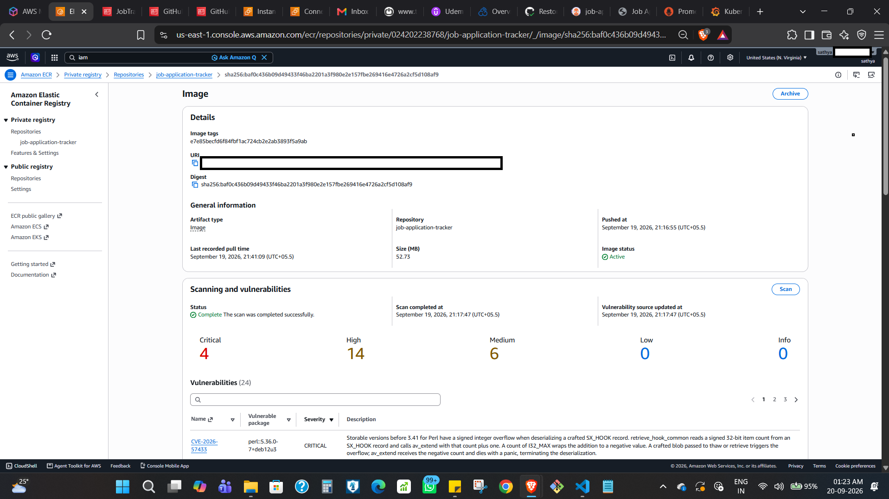

## Kubernetes / K3s

The application was deployed to a K3s Kubernetes cluster running on AWS EC2.

K3s was selected because it provides a lightweight Kubernetes environment suitable for a hands-on DevOps project while keeping the infrastructure simpler than a managed Kubernetes service.

Verify the Kubernetes node:

```bash
sudo kubectl get nodes
```

The cluster node was verified as:

```text
Ready    control-plane
```

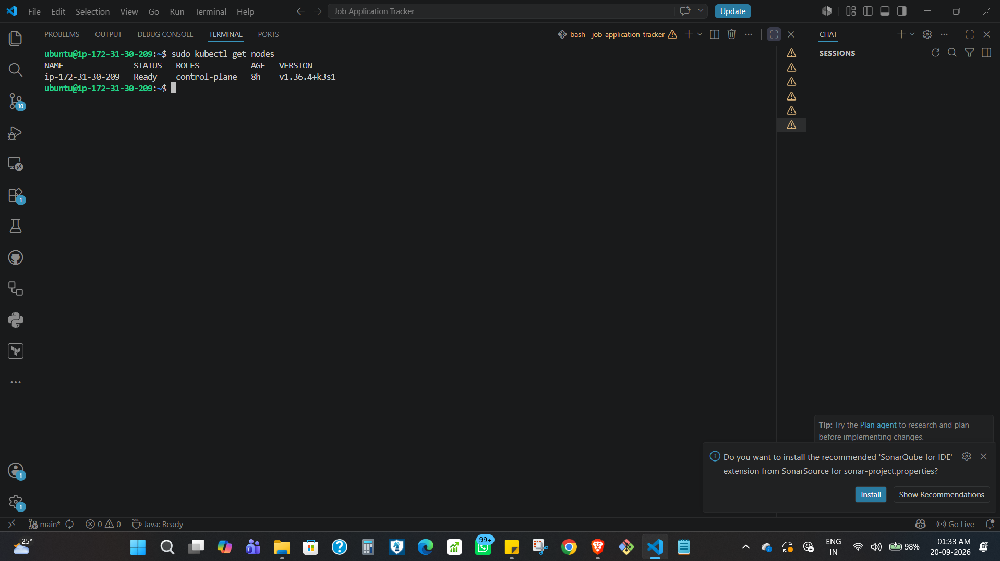

### Kubernetes Namespace

The application runs inside the:

```text
job-tracker
```

namespace.

The monitoring stack runs separately inside:

```text
monitoring
```

This keeps application workloads separated from monitoring workloads.

### Kubernetes Deployment

The Flask application is deployed using a Kubernetes Deployment.

The Deployment manages multiple application replicas.

Example configuration:

```yaml
replicas: 2
```

Verify the application pods:

```bash
sudo kubectl get pods -n job-tracker
```

Expected result:

```text
NAME                                  READY   STATUS
job-application-tracker-xxxxx        1/1     Running
job-application-tracker-yyyyy        1/1     Running
```

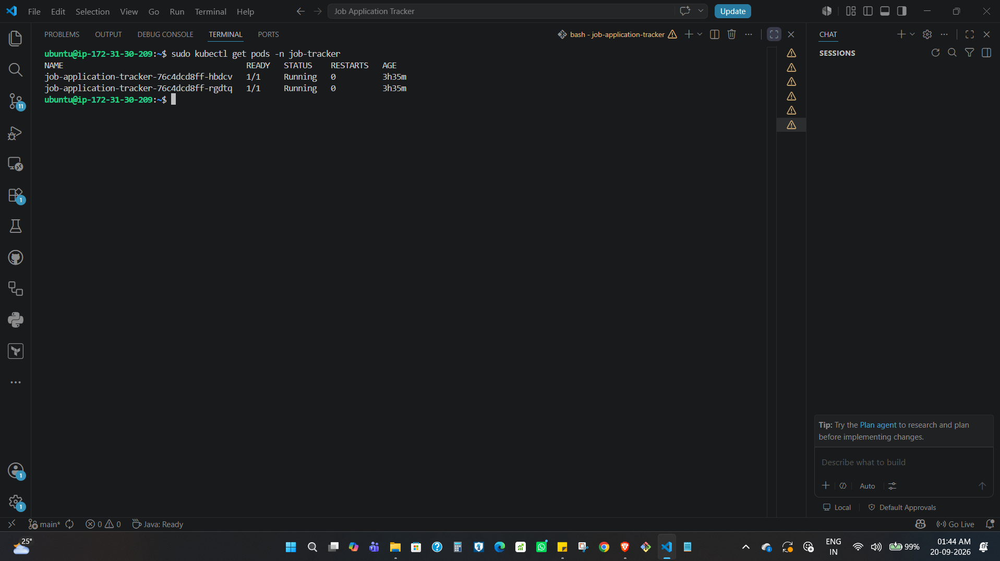

### Kubernetes Service

The Flask application is exposed internally through a Kubernetes ClusterIP Service, which sits behind Traefik Ingress and in front of the Deployment (see the traffic flow diagram under [Argo CD GitOps](#argo-cd-gitops) and [Application Access](#application-access) below).

Verify the Service:

```bash
sudo kubectl get svc -n job-tracker
```

The application Service listens on port 80 and forwards traffic to the Flask container port.

### Traefik Ingress

K3s includes Traefik as its Ingress controller. The application is exposed externally through a Kubernetes Ingress resource, while the Service itself remains a ClusterIP — the full request path (Browser → Traefik → Service → Deployment → Pods) is shown once under [Application Access](#application-access).

Verify the Ingress:

```bash
sudo kubectl get ingress -n job-tracker
```

The application was successfully accessed through the Kubernetes Ingress over HTTP.

### Private ECR Image Pull from Kubernetes

The Kubernetes cluster pulls the private application image from Amazon ECR:

```text
Amazon ECR → K3s kubelet → Container Runtime → Flask Pod
```

An EC2 IAM role with ECR read-only permissions was attached to the Kubernetes host, and an ECR credential provider was configured for K3s so the cluster could authenticate with the private ECR repository without storing static AWS credentials.

The private ECR image pull was tested successfully before deploying the application through Argo CD.

## Argo CD GitOps

Argo CD is used to implement GitOps-based Kubernetes deployment.

The Kubernetes manifests are stored in the GitHub repository under:

```text
k8s/
```

Argo CD watches the Git repository and synchronizes the desired Kubernetes state into the cluster:

```text
GitHub
   |
   | Kubernetes YAML
   v
Argo CD
   |
   | Sync
   v
K3s Kubernetes
   |
   v
Application Resources
```

Argo CD manages the Namespace, Deployment, Service, Ingress, ReplicaSets, and Pods for the application. Automated synchronization and self-healing were enabled.

### Argo CD Application Health

The final Argo CD application was verified as:

```text
Health: Healthy
Sync Status: Synced
```

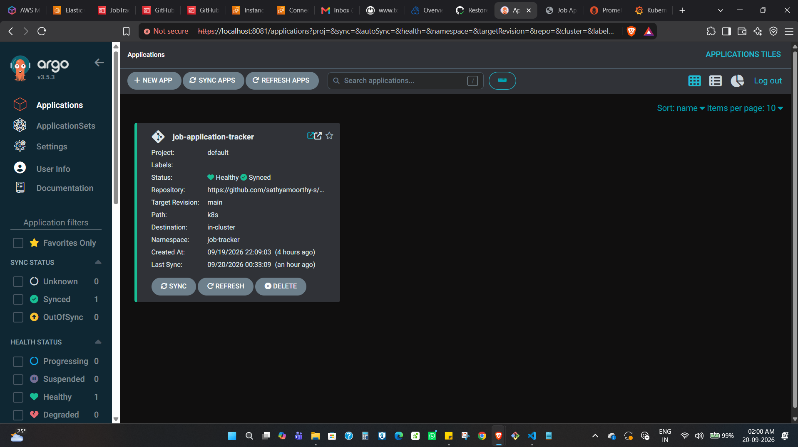

### GitOps Scaling Demonstration

A GitOps scaling test was performed to demonstrate the complete Git-to-Kubernetes workflow. The Deployment replica count was changed from `replicas: 2` to `replicas: 3`, committed, and pushed to GitHub. Argo CD detected the change and synchronized it automatically, and the cluster created the additional pod without any manual `kubectl` command:

```text
Git Change → GitHub → Argo CD Detects Change → Argo CD Sync → Kubernetes Deployment → 3 Application Pods
```

After the demonstration, the deployment configuration was restored to two replicas.

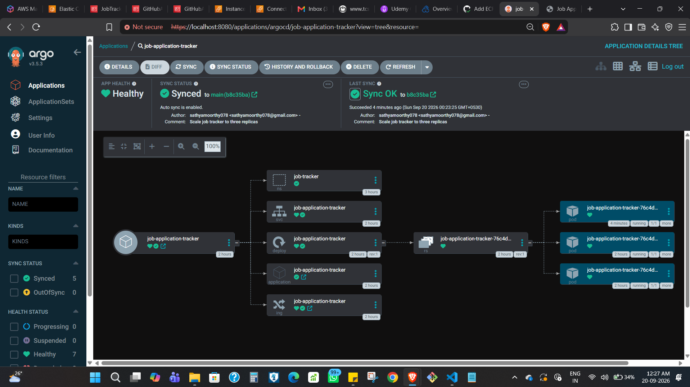

## Application Access

The deployed application was accessed through the Kubernetes Ingress. The complete request path was:

```text
User Browser
     |
     v
Traefik Ingress
     |
     v
ClusterIP Service
     |
     v
Flask Deployment
     |
     v
Flask Pods
```

The application provides:

- Add Job Application
- Search
- Update Status
- Edit
- Delete

A fictional sample company was used for the public project screenshot to avoid exposing real application information.

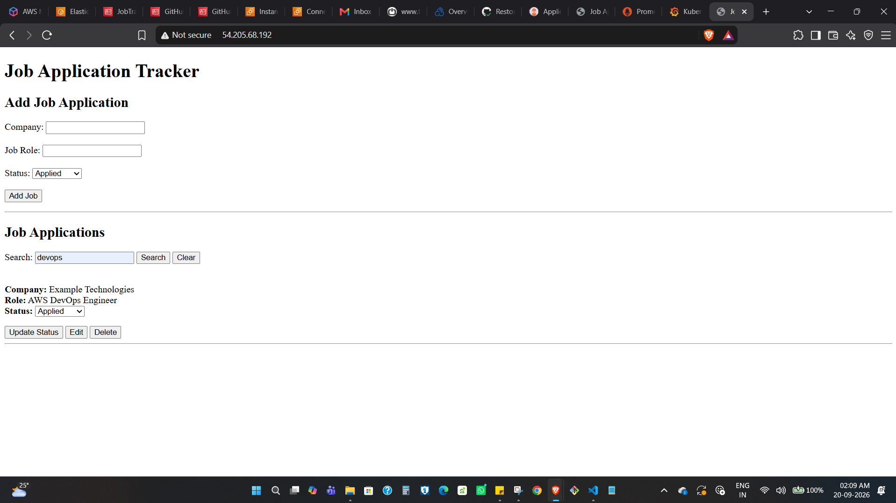

## Monitoring

Monitoring was implemented using Prometheus and Grafana, installed via the Prometheus community `kube-prometheus-stack` inside the `monitoring` namespace.

```text
Kubernetes / Application
    |
    +--> Node Exporter
    |
    +--> kube-state-metrics
    |
    +--> Kubernetes API Server
    |
    v
Prometheus
    |
    v
Grafana
```

### Prometheus

Prometheus collects metrics from Kubernetes and infrastructure components, including Alertmanager, Node Exporter, kube-state-metrics, the Kubernetes API server, and CoreDNS. Target health was verified through the Prometheus Targets page, with all configured targets reporting `UP`.

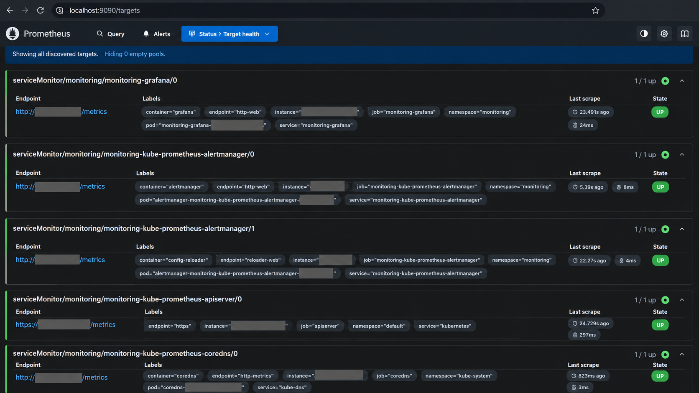

### Grafana

Grafana visualizes the metrics collected by Prometheus. The Kubernetes dashboards provide visibility into cluster CPU/memory utilization, namespace resource usage, and per-pod CPU/memory usage, requests, and limits.

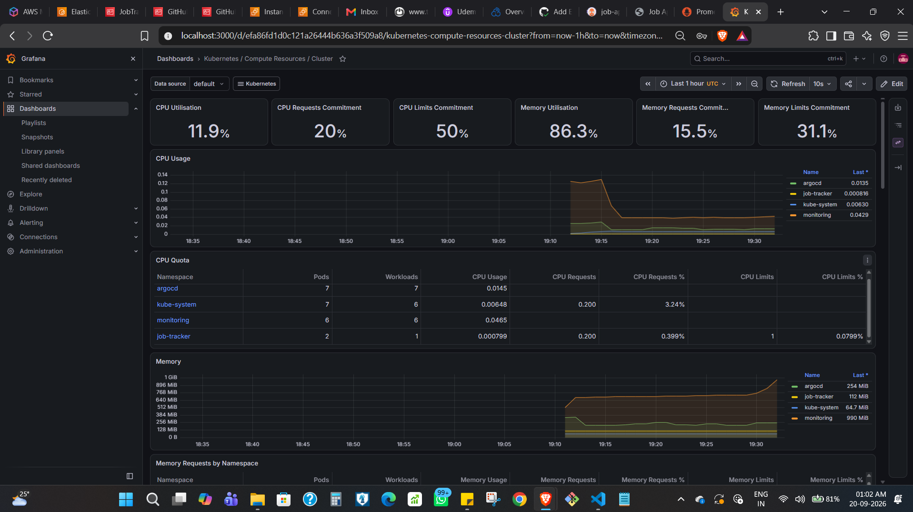

### Pod-Level Monitoring

Grafana was also used to monitor the Job Application Tracker pods specifically, covering CPU usage, CPU requests/limits, memory usage, and overall pod resource consumption.

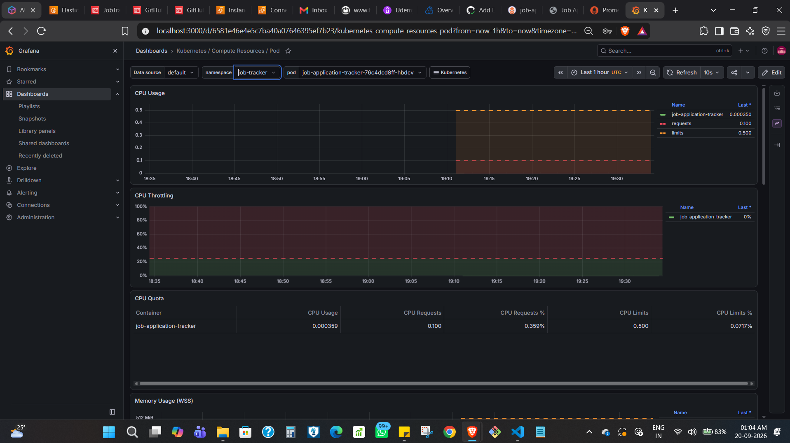

## Data Persistence

The application currently stores job application records within the running Flask process rather than in a dedicated external database. This keeps the project focused on the DevOps workflow rather than data-layer design, but it also means application data does not survive a pod restart, rolling update, or rescheduling event — each new pod starts with an empty state.

This is a known and intentional simplification for a DevOps-focused portfolio project. Adding a persistent backing store (e.g., a managed database or a PersistentVolumeClaim-backed database pod) is listed under [Future Improvements](#future-improvements).

## Verification

The project was verified using GitHub, Docker, Kubernetes, Argo CD, Prometheus, and Grafana commands at different stages.

Key verification commands include:

```bash
# Run application tests
python -m pytest -v

# Verify Docker
docker version

# Verify Kubernetes cluster
sudo kubectl get nodes

# Verify application pods
sudo kubectl get pods -n job-tracker

# Verify application Service
sudo kubectl get svc -n job-tracker

# Verify Ingress
sudo kubectl get ingress -n job-tracker

# Verify Argo CD application
sudo kubectl get application job-application-tracker -n argocd

# Verify monitoring pods
sudo kubectl get pods -n monitoring

# Verify monitoring Services
sudo kubectl get svc -n monitoring
```

The implementation was verified for:

- Successful Flask application execution
- Successful automated testing
- Successful Docker image creation
- Successful SonarCloud analysis
- Successful Trivy scanning
- Successful Amazon ECR image publishing
- Successful Kubernetes deployment
- Successful private ECR image pulling
- Successful Traefik Ingress configuration
- Successful Argo CD synchronization
- Successful GitOps scaling
- Successful application access
- Successful Prometheus target scraping
- Successful Grafana monitoring

## Troubleshooting

Several real-world DevOps issues were encountered during implementation and resolved through logs, command-line diagnostics, configuration changes, and verification — including AWS OIDC authentication failures, a Kubernetes manifest directory-structure mistake, an Argo CD sync gap, private ECR image-pull configuration, and a Docker base-image vulnerability fix.

The full log of each issue, its root cause, and the fix applied is documented separately in [TROUBLESHOOTING.md](TROUBLESHOOTING.md).

## Selected Project Evidence

The following screenshots highlight the most important implementation and verification points.

### GitHub Actions


Shows the successful CI pipeline execution.

### Amazon ECR


Shows the container image successfully published to the private registry.

### Kubernetes Pods


Shows the Job Application Tracker application pods running successfully.

### Argo CD


Shows the application synchronized and healthy in Argo CD.

### Live Application


Shows the deployed Job Application Tracker application.

### Prometheus


Shows Prometheus targets reporting healthy status.

### Grafana


Shows Kubernetes monitoring dashboards.

### Final Architecture


Shows the complete DevOps architecture.

The remaining screenshots are retained in the `Screenshots/` directory as additional project evidence.

## Security Considerations

The project uses several security practices:

- GitHub Actions uses AWS OIDC instead of long-lived AWS access keys
- ECR access is controlled through AWS IAM
- Kubernetes pulls the private image using IAM-based authentication
- Trivy scans the Docker image for vulnerabilities
- SonarCloud performs static security analysis
- Sensitive credentials (including the SonarCloud token) are stored as GitHub repository secrets, never in source code
- SSH private keys are excluded from Git
- `.pem` files are excluded using `.gitignore`
- Argo CD is not directly exposed to the public internet
- Monitoring interfaces are accessed through secure local port forwarding
- Public screenshots were reviewed to avoid exposing credentials and sensitive AWS information

## AWS Cost Management

The Kubernetes environment was intentionally implemented using K3s on a single EC2 instance rather than a managed Kubernetes service. This approach reduced infrastructure complexity and cost while still demonstrating a full AWS + Kubernetes + GitOps + Monitoring stack.

The infrastructure was treated as a temporary environment for this project: after collecting all required screenshots and completing verification, all temporary AWS resources were removed to avoid unnecessary charges (see [Cleanup](#cleanup)).

## Cleanup

The following checklist was completed before terminating the temporary AWS environment:

- [x] Save all project screenshots
- [x] Verify GitHub repository
- [x] Verify GitHub Actions
- [x] Verify SonarCloud
- [x] Verify Trivy
- [x] Verify Amazon ECR
- [x] Verify Kubernetes
- [x] Verify Argo CD
- [x] Verify live application
- [x] Verify Prometheus
- [x] Verify Grafana
- [x] Push final README
- [x] Terminate temporary EC2 instance
- [x] Verify EBS volume cleanup
- [x] Remove unused security group
- [x] Delete ECR repository
- [x] Remove temporary EC2 IAM role
- [x] Remove unused GitHub Actions IAM role
- [x] Verify no unexpected AWS resources remain

All temporary AWS resources for this project have been removed. The repository is retained as a complete, reproducible reference — redeploying it only requires provisioning a new EC2/K3s host and Amazon ECR repository, and updating the corresponding IAM roles and GitHub Actions secrets.

## Future Improvements

The current project focuses on demonstrating a complete DevOps lifecycle around a simple Flask application. Since the underlying AWS infrastructure has been decommissioned, these are documented as forward-looking improvements for a future iteration rather than features implemented in this version:

- Persistent data storage (e.g., a managed database or PVC-backed database pod) instead of in-process storage
- Liveness and readiness probes, and CPU/memory resource requests and limits, on the Flask Deployment
- Terraform-based AWS infrastructure provisioning
- Separate development and production environments
- Kubernetes Horizontal Pod Autoscaler
- HTTPS/TLS using cert-manager
- Kubernetes Secret management using an external secret manager
- Alertmanager notifications
- Centralized logging using Loki
- Application performance monitoring
- Automated image tag updates through GitOps
- Blue/green or canary deployment strategies
- Infrastructure-as-Code for the complete AWS environment
- Automated backup and disaster recovery

## Project Outcome

The Job Application Tracker evolved from a simple Flask application into a complete end-to-end DevOps project. The final workflow demonstrates:

```text
Application Development
        |
        v
GitHub
        |
        v
GitHub Actions
        |
        +--> Pytest
        |
        +--> SonarCloud
        |
        +--> Docker Build
        |
        +--> Trivy
        |
        v
Amazon ECR
        |
        v
K3s Kubernetes
        |
        +--> Traefik
        |
        +--> Flask Pods
        |
        +--> Prometheus
        |
        +--> Grafana
        |
        ^
        |
     Argo CD
        ^
        |
      GitHub
```

The project demonstrates practical experience with CI/CD, automated testing, static code analysis, containerization, container security, AWS IAM, GitHub OIDC, Amazon ECR, Kubernetes, K3s, GitOps, Argo CD, Kubernetes Ingress, Prometheus, Grafana, and real-world DevOps troubleshooting.

## Conclusion

This project demonstrates how a simple application can be taken through a complete DevOps lifecycle:

```text
Code → Test → Analyze → Build → Scan → Publish → Deploy → Synchronize → Monitor
```

The primary objective was not to build a complex application, but to demonstrate the practical implementation of a modern DevOps workflow from source code through deployment and observability.

## License

This project is licensed under the [MIT License](LICENSE). Feel free to fork, adapt, or use it as a reference for your own DevOps learning projects.

## Author

**Sathyamoorthy S**
DevOps / Cloud Engineering Portfolio Project

- GitHub: [github.com/sathyamoorthy-s](https://github.com/sathyamoorthy-s)
- LinkedIn: [linkedin.com/in/sathya-moorthy-sivaraj](https://www.linkedin.com/in/sathya-moorthy-sivaraj)

### Technologies Demonstrated

Linux, AWS, Git, GitHub, GitHub Actions, Python, Flask, Pytest, Docker, SonarCloud, Trivy, Amazon ECR, Kubernetes, K3s, Argo CD, Traefik, Prometheus, Grafana
